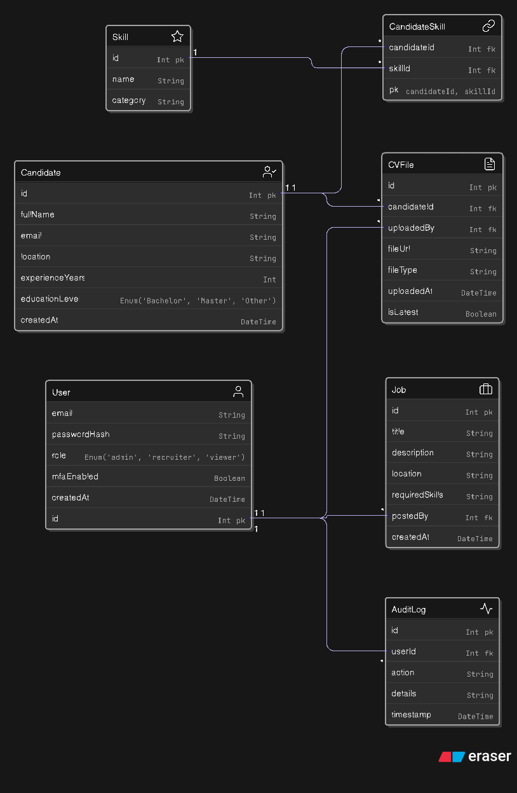

# Database Schema

This folder contains the full SQL schema and ER diagram used in the CV Portal system. I’ve used MySQL as the database for this project.

---

## Core Tables

- `users` – recruiters and admins
- `candidates` – parsed from uploaded CVs
- `cv_files` – uploaded CV documents
- `skills` – list of extracted skills
- `candidate_skills` – links skills to candidates
- `jobs` – open positions to match candidates
- `job_templates` – reusable job posting templates
- `audit_logs` – security event logging (e.g. login, data access)

---

## ER Diagram



stored in this repo under `ERD.png`.

---

## SQL DDL

You can find the full schema in `schema.sql`. It includes:

- All table definitions
- ENUMs for fields like file type and education level
- Primary/foreign key constraints
- Indexes on searchable columns

---

## Sample Queries

```sql
-- 👤 List all recruiters
SELECT id, email FROM users WHERE role = 'recruiter';

-- 📄 Show all CVs uploaded in the last 7 days
SELECT id, fileUrl, uploadedAt FROM cv_files
WHERE uploadedAt >= CURDATE() - INTERVAL 7 DAY;

-- 🧑‍💻 List all candidates and their experience
SELECT fullName, experienceYears FROM candidates ORDER BY experienceYears DESC;

-- 🎓 Find candidates with a Master’s degree
SELECT fullName, educationLevel FROM candidates WHERE educationLevel = 'Master';

-- 🧠 Get all defined skills
SELECT name FROM skills ORDER BY name;

-- 🔍 Show jobs that require "React"
SELECT title, location FROM jobs
WHERE requiredSkills LIKE '%React%';

-- 🔐 List all failed or locked login accounts
SELECT email, failedLoginAttempts, lockUntil FROM users
WHERE failedLoginAttempts > 0 OR lockUntil IS NOT NULL;

-- 📊 Show audit logs for a specific user (e.g., ID 2)
SELECT action, details, timestamp FROM audit_logs WHERE userId = 2;

